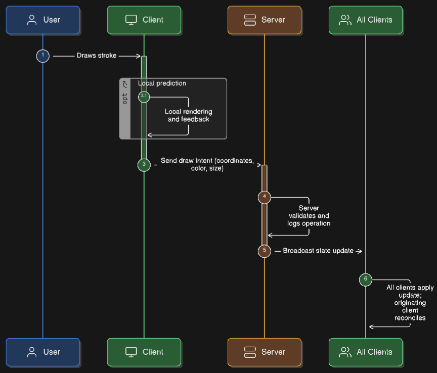

# Application Architecture

This doc explains the architecture of our real-time canvas. We chose a server-authoritative model to make sure every user sees the same thing and the experience is consistent.

## Guiding Principles

-   **The Server is the Source of Truth**: The server always holds the correct state of the canvas. Clients are just responsible for rendering that state, not storing it. This is the simplest way to prevent users from getting out of sync.

-   **Drawing as a Series of Events**: We model the canvas as a log of drawing operations (like "draw a line" or "erase"). The canvas is redrawn by replaying these events in order. This guarantees consistency and makes features like undo/redo much easier to implement.

-   **The Server Decides the Order**: The server is the sole authority on the order of events. When a client sends a drawing command, the server validates it, gives it a final timestamp and ID, and adds it to the log. This simple rule is how we handle "conflicts" before they can even happen.

## Data Flow Diagram

Here's the journey of a single brush stroke:

1.  **A user draws something.**
2.  **Instant Feedback**: To make the app feel fast, the client renders the stroke locally right away. This is often called "local prediction" or "optimistic rendering."
3.  **Off to the Server**: The client sends a `draw` message over the WebSocket with the stroke's details (coordinates, color, etc.).
4.  **Making it Official**: The server gets the message, checks that it's valid, and adds it to the official event log for the room.
5.  **Broadcasting the Change**: The server then broadcasts the official operation to *every* client in the room, including the person who drew it.
6.  **Getting in Sync**: All clients receive the new operation and draw it on their canvases. This step ensures everyone's canvas is identical and corrects any small differences from the initial local prediction.

## WebSocket Protocol

We use a simple WebSocket protocol for fast, two-way communication between the client and server.

### Client to Server
-   `room:join`: Lets a user join a specific drawing room.
-   `draw`: Submits a new drawing operation.
-   `undo` / `redo`: Asks to undo or redo an action.

### Server to Client
-   `state:init`: Sent when a user first joins, this contains the room's entire drawing history so they can catch up.
-   `state:update`: The most common message. It broadcasts a single, new drawing operation to everyone.
-   `state:sync`: Sent after an undo/redo. This provides the complete, updated list of active operations.

## Undo/Redo Strategy

Undo and redo are global actions that affect everyone in the room, and they don't destroy any drawing history.

-   **It's All About the Cursor**: We never delete history. Instead, the server keeps a "cursor" or pointer to the current position in the event log.
-   **Moving Through History**: An "undo" just moves the cursor backward one step. A "redo" moves it forward.
-   **Resyncing Everyone**: After the cursor moves, the server sends the *entire active history* (everything up to the cursor) to all clients via `state:sync`. Clients clear their canvas and replay that history. It's a blunt but effective way to ensure everyone sees the exact same thing.

## Conflict Resolution

Our architecture is designed to avoid conflicts entirely.

-   **Whoever Gets to the Server First, Wins**: We handle simultaneous drawing with a simple "first-come, first-served" rule. Whichever client's drawing event reaches the server first gets added to the log first. We don't do any complex real-time merging (like with CRDTs).
-   **Single Source of Truth**: This works because the server is the ultimate authority on the order of events. There are no other "truths," so there are no conflicts to resolve.

## Performance & Optimizations

We made a few key decisions to keep the app feeling fast and responsive.

-   **Local Prediction for a Snappy Feel**: As noted earlier, drawing the stroke on the client first makes the app feel instant and hides any network lag.
-   **Lean Payloads**: For most updates, we only send a single, small `state:update` message containing just the latest action. We only send the full history when someone joins or undoes, which is less frequent.
-   **Dumb Clients, Smart Server**: We keep the client-side code simple. It's mostly just for rendering. All the hard work of managing state happens on the server.
-   **Hardware-Accelerated Erasing**: We use the canvas's built-in `destination-out` composite operation for the eraser. It's incredibly efficient and fast because the browser can often run it on the GPU.

## Key Implementation Details

-   **Smoother Lines with Bézier Curves**: To make the drawings look less jagged and more natural, we smooth out the user's strokes using Quadratic Bézier curves. Instead of just connecting the dots with straight lines, we calculate midpoints to create fluid, curved lines.
-   **Room Isolation**: The server code keeps each room completely separate. Every room has its own event log and list of users. When the last person leaves a room, we clean up its data from memory.
-   **Input Validation**: We're careful to validate every message that comes in from a client against a strict schema. This prevents bad data from corrupting the canvas state.
