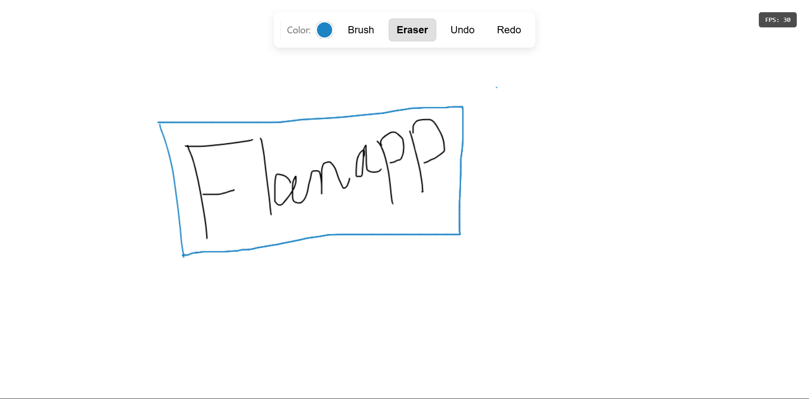

# Real-Time Collaborative Canvas

A simple, real-time collaborative whiteboarding application that allows multiple users to draw together in the same "room." It showcases a server-authoritative architecture using WebSockets for low-latency communication.
### Live Demo

You can also access a live deployment here: [https://sunny-yeot-fb0cc8.netlify.app/](https://sunny-yeot-fb0cc8.netlify.app/)



## Features

-   **Real-Time Collaboration**: Drawings appear on all connected clients' screens instantly.
-   **Core Drawing Tools**: Includes a standard brush and an eraser.
-   **Active Tool Indication**: The currently selected tool is visually highlighted in the toolbar for clarity.
-   **Color Picker**: A simple, modern color picker to change the brush color.
-   **Global Undo and Redo**: Step backward or forward through the drawing history. The action is synchronized for all users.
-   **Smooth Line Rendering**: Brush strokes are smoothed using Quadratic Bézier curves for a more natural, fluid appearance.
-   **Performance Display**: A client-side FPS counter helps monitor rendering performance.
-   **Room-Based Architecture**: The backend is designed to isolate drawing sessions by room, even though the UI for room selection is not yet implemented.

## Tech Stack

-   **Frontend**: TypeScript, HTML5 Canvas, Vite
-   **Backend**: Node.js, TypeScript, `ws` library for WebSockets
-   **Development**: `concurrently` to run client and server with one command.

## Architecture

This project uses a server-authoritative model with an event-sourcing approach. The server acts as the single source of truth, capturing all drawing operations in an ordered log and broadcasting them to clients. This ensures that all users have a perfectly synchronized state.

For a detailed breakdown of the data flow, WebSocket protocol, and design decisions, please see the **[ARCHITECTURE.md](ARCHITECTURE.md)** document.

## Local Development

To get the project up and running locally, follow these steps:

1.  **Clone the Repository**
    ```bash
    git clone https://github.com/bravo1goingdark/realtime-collaborative-canvas
    cd realtimecanvas
    ```
2.  **Install Dependencies**
    ```bash
    npm install
    ```
3.  **Run the Application**
    Use the `start` script to launch both the server and client concurrently from a single terminal:
    ```bash
    npm start
    ```
    The client will be available at `http://localhost:5173`.


## How to Test Collaboration

To see the real-time features in action:

1.  **Open multiple browser tabs** to the client URL. Each tab will act as a separate user.
2.  **Draw** in one tab and watch your strokes appear instantly on the others.
3.  **Test Undo/Redo** by clicking the buttons. The last operation—regardless of who drew it—will be removed or restored for everyone.

## Future Improvements

-   **User Authentication**: Implement a system to identify and differentiate users.
-   **Expanded Drawing Tools**: Add UI options for changing brush and eraser sizes.
-   **State Persistence**: The canvas state is currently stored in-memory. Implementing a persistence layer (e.g., using a file-based log or a database like Redis) would allow drawings to survive a server restart.
-   **Room Management UI**: Create a user interface for users to create, list, and join different rooms.
-   **Improved Error Handling**: Make the client more resilient to network disconnects or invalid server messages.

## Time Spent on the Project

Approximately 3 days were spent on this project, focusing on implementing the core real-time collaborative drawing functionality, WebSocket communication, undo/redo logic, and server-side state management.
